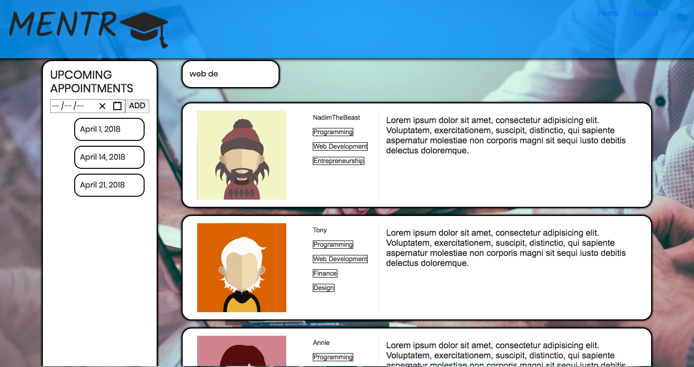
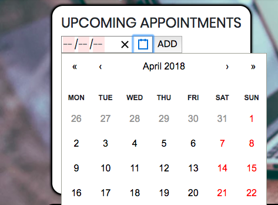
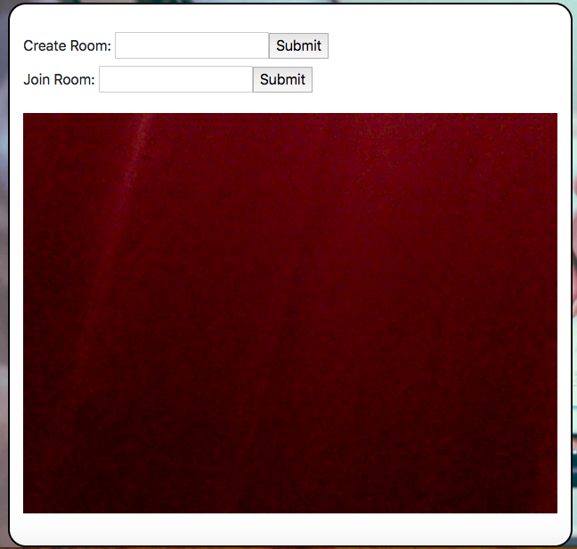

# Mentr
Won Most Complete and Functional project at WDF/TTP 1-day Hackathon

## Objective
One to one mentorship platform where users can find mentors by skills and schedule appointments with them.

## Tech Stack
* [React](https://reactjs.org/)
* [Node](https://nodejs.org/en/)
* [PostgreSQL](https://www.postgresql.org/)
* [WebRTC](https://webrtc.org/)

## Meet the Team
* Nadim Uddin - [Nuddin95](https://github.com/nuddin95) 
* Brian Deriel - [Brian4292](https://github.com/Brian4292) 
* Jose Sabal - [ODEit](https://github.com/ODEit)

## Build Status
Functional and in progress

## Pictures!

 
 
 
 

